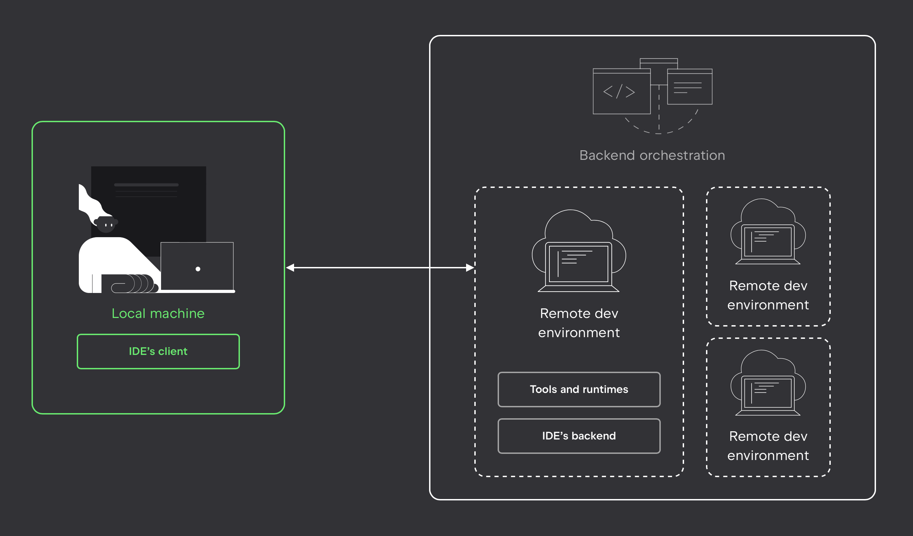

This online course allows you to learn remotely without the hassle of setting up and configuring your environment on your own computer.

When you open a course, our service automatically creates a dedicated cloud environment just for you. This environment runs in the cloud as a container, pre-configured with everything needed for the course — the latest version of the IDE, course materials, and a set of essential tools (such as the required libraries, plugins, and system dependencies).

At the same time, JetBrains Toolbox launches on your computer, preparing and running the client-side of the IDE while establishing a connection to the cloud environment.

This setup allows you to learn even on relatively low-powered computers, as all heavy computations are handled in the cloud on machines with guaranteed adequate resources, including GPU support. Your progress is saved on our servers, enabling you to start learning on one device and seamlessly continue on another.
