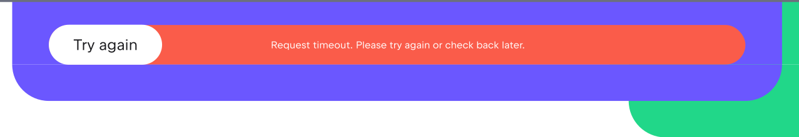

We hope that your interaction with the course proves to be enjoyable and smooth, but you may occasionally encounter some difficulties.

Starting a remote machine can take up to 5 minutes. If there is a free machine on the server, we will start it in seconds; however, if not, we need time to start a new one. You will see the appropriate status on [the course page](https://academy.jetbrains.com/course/build-games-with-ai-and-alphazero). If you see an error during the process or if the status doesn't change for more than 5 minutes, please reload the page and try again.

If your remote IDE is running slowly, please ensure you have a strong and stable internet connection with at least 20 Mbps bandwidth and no more than 200 ms latency.

In case you encounter technical difficulties, you can [contact us](https://intellij-support.jetbrains.com/hc/en-us/requests/new?ticket_form_id=66731&product=jetbrains_academy) for support or report a problem in our [issue tracker](https://youtrack.jetbrains.com/newIssue?project=WEEDU).
