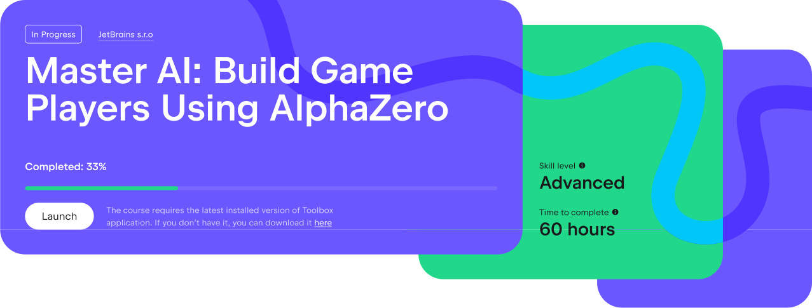
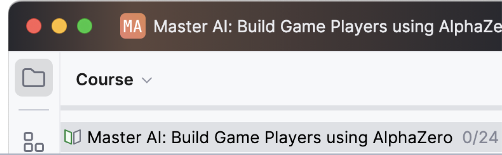

We have made every effort to ensure that working with the course is as comfortable as possible. For this purpose, we have gathered all the necessary information on the [course web page](https://academy.jetbrains.com/course/build-games-with-ai-and-alphazero).

You can close the IDE and return to the course at any time. To do this, click the _Launch_ button.

As you complete tasks, your progress bar will grow and be stored on the server.

You can see your progress right in the IDE above the assignment list or on the course page after logging in.

