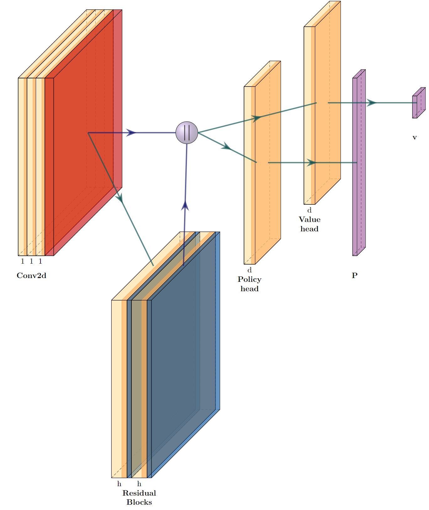

### Building neural network for next move prediction and position evaluation
As we know from the short yet revolutionary article ["Mastering Chess and Shogi by Self-Play with a
General Reinforcement Learning Algorithm"](https://arxiv.org/abs/1712.01815)
instead of a handcrafted position evaluation function and move ordering heuristics,
AlphaZero utilises a deep neural network:
$$(p, v) = NN_\theta(s)$$
with parameters $\theta$. This neural network takes the board position $s$ as an input and outputs a vector of move probabilities $p$ with components $p_a = Pr(a\mid s)$ for each action $a$,
and a scalar value $v$ estimating the expected outcome $z$ from position $s$, $v \approx \mathbb{E}[z|s]$.
AlphaZero learns these move probabilities and value estimates entirely from selfplay;
these are then used to guide its search via MCTS.

So in this task we will build neural network for next move prediction (`PolicyHead` part) and position evaluation (`ValueHead` part).

Below is a diagram of the neural network that we propose to use.

### Task
1. Implement the `startBlock` using sequential `torch.nn` layers: Conv2d, BatchNorm2d and ReLU.
2. Implement the `policyHead` using sequential `torch.nn` layers: Conv2d, BatchNorm2d, ReLU, Flatten and Linear.
3. Implement the `valueHead` using sequential `torch.nn` layers: Conv2d, BatchNorm2d, ReLU, Flatten, Linear and Tanh.
